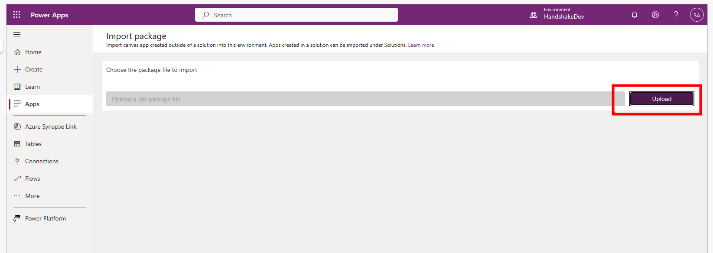
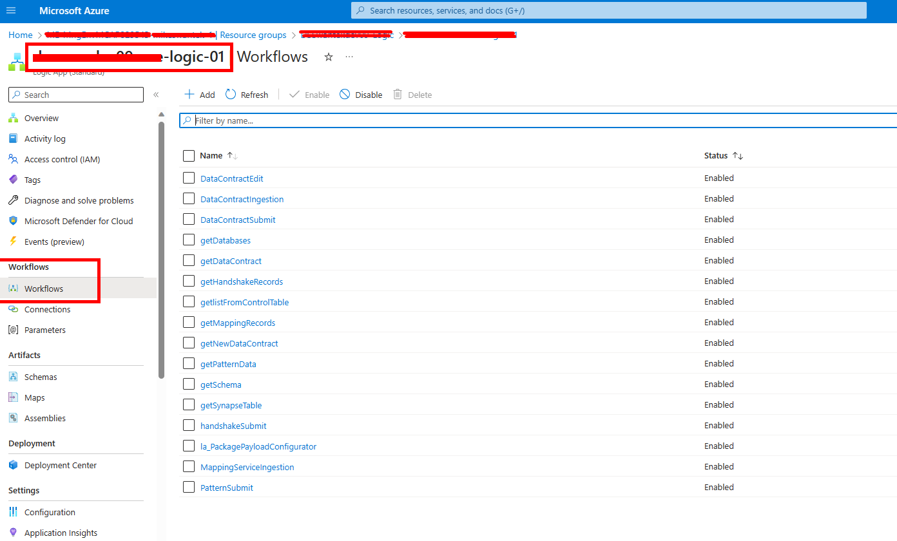

# Data and AI Portal Deployment
At this time, we do not have the deployment of the Power App and Power Automate flow automated. We are working on this. 
For now, please follow these steps to deploy and configure the Handshake App for use.

1. Download the zip file from the repo 

2. Open the Power App environment. This would be set up and supplied by the customer. We do not deploy the Power Platform via code at this time. 
3. Add the following connection to the environment:
- Microsoft 365 users connection - authenticate as admin of power platform (service account)

4. Select the Apps tab in the left navigation and then Import Canvas App that you downloaded locally,using the button in the header. 

5. Select the upload button and navigate to the location of the package file from the GitHub repo.

6. On this screen, you can rename the app before it is added to the environment. Select the ‘wrench’ icon to change settings. 
**Note that the flows needed to communicate with the Logic Apps are deployed with the app.**

7. The next step it so enable the flows. Navigate to the Flows section and notice that the flow is greyed out. This is because it is deployed in a disabled state. We must enable it for the solution to work. 
Click the triple dots and select ‘Turn on’

8. Now we will get the uri address that from the Logic App. We must get the endpoint address of the Logic App and copy it first.
 -  Navigate to the Logic App resource group in the subscription.
 -  Open the DataContractIngestion Logic app.

9. Edit the Logic App in Designer mode

10. Now we will edit the uri address that points to the Logic App. Start by editing the flow. You will need to navigate back to the Power Apps environment.

111. Select the HTTP connector and paste on the value copied from the Logic App in step 11

12. Save the Power Automate Flow

13. Repeat this process for each of the logic apps/flows

| Flowname | LogicApp called | SP it calls |
| --- | --- | --- |
| getMappingRecords |  getMappingRecords | queries the mapping table |
| getPatternData    | getPatternData    | queries the pattern table |
| DataContractMappingSubmit | MappingServiceIngestion | InsertDataMapping |
| getDataContract | getDataContract | queries the DataContract table |
| GetSchemaSynapsedb | getSynapseTable | queries the information_schema.columns query  |
| schema | getSchema | dbo.schemaDynamic (serverless) |
| getHandshakeRecords | getHandshakeRecords | queries the dbo.handshake table  |
| getFromControl | getlistFromControlTable | Queries the IngestedLandingDataAudit |
| HandshakeSubmit | handshakeSubmit | usp_InsertHandshake |
| getDatabases | getDatabases | Query: SELECT * FROM sys.databases  |
| DataContractSubmit | DatacontractSubmit | usp_InsertDataContract |
| DataContractEdit | DataContractEdit | usp_EditDataContract |
| getDataAssetTechnicalValues| getNewDataContract |  usp_getDataContractRecordsDynamic |

Now the required connections have been configured for the app and flows.

14. Navigate to the Power App and Edit the app

15. The first time this is edited, you will be prompted to connect to the needed connections. The system will install this as the user that is currently logged in, so be sure it is with the service account or admin account so that the connector will work for all users.
Click allow

At this point the Handshake Shared Service is configured and will now allow data registration into the control table.

