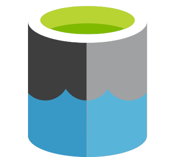
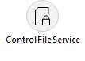
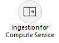
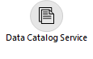
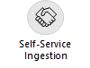

# Introduction
This Wiki provides guidance to utilising Delivery IP created to assist with the delivery of Data Strategy engagements. The Data Strategy offering is the foundation for implementing Data Platform solutions in FY22, and leverages Microsoft's own internal Data Estate journey. Offer collateral and further information about Data Strategy can be found in the SharePoint site below. Please refer to this site for all pre-sales and associated artifacts: 
 - **[Microsoft Industry Solutions - Data Strategy](https://microsoft.sharepoint.com/teams/MCSDataStrategy/)**

# Product Backlog
- [Click Here to Navigate to Product Backlog with Epics, Features, and User Stories](DataStrategyBacklog.xlsx)

# Steps to Deploy IP
- [Click Here to Navigate to Deployment Instructions](DeliveryIP_GitHub/README.md)

# Secure and Quality by Default
For security guidance, please review the current Secure by Default guidance here [Secure by Default on SDMPlus](https://sdmplus2.azurewebsites.net/topics/consulting/276) which describes several important delivery activities such as completion of the Secure by Default attestation and Data Protection Questionnaire.

Additional Secure by Default information and support can be found on the Azure Cloud & AI Secure by Default site [aka.ms/acaisbd](https://aka.ms/acaisbd) and [Secure by Default Feedback and FAQ](https://microsofteur.sharepoint.com/teams/SecureByDefault/SitePages/FAQ.aspx). 

# Data Strategy Delivery IP
Part of the Data Strategy approach recognises that the creation of Delivery IP can assist Industry Solution Delivery (ISD) teams in jumpstarting their customer engagements, enabling a consistent approach to be adopted during delivery. This IP acts as an 'accelerator' for deploying and configuring key Azure services that are used to produce the overall reference architecture for the Data Strategy offering. 

## Components
The Data Strategy Delivery IP consists of the following components:

| Delivery IP  Component  | Description |
|--|--|
|  |   Data Strategy Reference Backlog (Epics, Features and User Stories) matching the primary components detailed in the Offering collateral which can be imported into a Customer's Azure DevOps project and enhanced according |
|  |  Bicep templates, code examples for each of the primary Data Strategy components  |
|  | YAML pipelines enabling rapid deployment of code artefacts |
|  | Wiki containing Architecture patterns, documentation, and usage scenarios |

## Focus Areas
The primary focus areas for the Delivery IP are intended to realise components described in the introductory Data Strategy Accelerator offering firstly, before moving to include other services listed in the wider Data Strategy Standard and Enterprise sizes. These are detailed below.

| Focus Area | Description |
|--|--|
|  | Provisioning of Data Lake components allowing deployment of single or multiple Azure Storage Accounts with Hierarchical Namespace Feature enabled. |
|  |Meta-data driven service to assist with data ingestion scenarios |
|  | Provision of  compute  services  with integration with Data Lake |
|  | Integration with Azure Purview through provisioning and configuration | 
|  | Implementation of a self-service data ingestion process |

## Additional Info
Additionally to the information above, please read and be familiar with:

## Data Strategy Reference Architecture
This is always in progress as we align / update / receive feedback from Product Groups. Please ensure you review also the Complex Data Management slide deck for field guidance
 - [Data Strategy Reference Architecture](https://microsoft.sharepoint.com/:p:/t/MCSDataStrategy/EeR_4e3-ZyFLimHfFIjOKUYBkpwvm666D8Mdp8YypT-cnQ?e=tFFH93&CT=1681233813004&OR=Outlook-Body&CID=4E260BA7-26CD-4B93-8E12-422E78C8B2B0)

## Complex Data Management Field Guidance
This deck is of utmost importance. It contains the current state of Microsoft Data Platform Product Group field guidance. It contains confidential information and should not be used as is with customers.

- [Complex Data Management](https://microsofteur.sharepoint.com/:p:/t/DataStrategyIPCreators/EaZ2BWaAHD5CmDXsdq51aAkBiQ5XHzipzqt0HqDh3VoEPQ?e=gYXnN8)

## Wiki Git
Please use git to pull / push your documentation updates. Link to git (link is not available from the UI)
- https://servicescode.visualstudio.com/Data%20Strategy%20Reference%20Implementation/_git/Data-Strategy-Reference-Implementation.wiki

This Delivery IP is intended to assist with delivery of customer engagements. It is possible that not all components will be relevant to every customer - this will need to be discovered and assessed during the Data Strategy Workshops stage to understand the Customer's current technical landscape. Also, the reference backlog may need amending to include customer-specific items in addition to those detailed in the base implementation.

## Contributing

This project welcomes contributions and suggestions.  Most contributions require you to agree to a
Contributor License Agreement (CLA) declaring that you have the right to, and actually do, grant us
the rights to use your contribution. For details, visit https://cla.opensource.microsoft.com.

When you submit a pull request, a CLA bot will automatically determine whether you need to provide
a CLA and decorate the PR appropriately (e.g., status check, comment). Simply follow the instructions
provided by the bot. You will only need to do this once across all repos using our CLA.

This project has adopted the [Microsoft Open Source Code of Conduct](https://opensource.microsoft.com/codeofconduct/).
For more information see the [Code of Conduct FAQ](https://opensource.microsoft.com/codeofconduct/faq/) or
contact [opencode@microsoft.com](mailto:opencode@microsoft.com) with any additional questions or comments.

## Trademarks

This project may contain trademarks or logos for projects, products, or services. Authorized use of Microsoft 
trademarks or logos is subject to and must follow 
[Microsoft's Trademark & Brand Guidelines](https://www.microsoft.com/en-us/legal/intellectualproperty/trademarks/usage/general).
Use of Microsoft trademarks or logos in modified versions of this project must not cause confusion or imply Microsoft sponsorship.
Any use of third-party trademarks or logos are subject to those third-party's policies.
